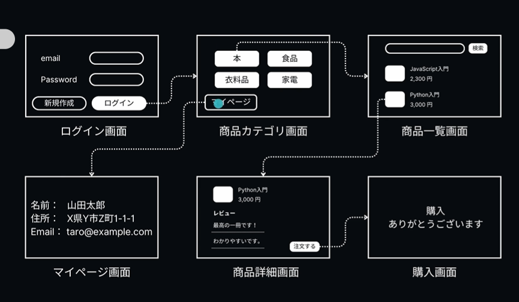
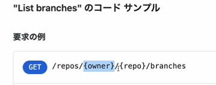

こんなアプリケーションのWebAPIのエンドポイント作成をしてみる

一旦雑にしてみる
リソースに着目する
* ユーザ
* 商品
* カテゴリー

動画の例だとこうなる
* USERS
* PRODUCTS
* CATEGORIES
* REVIWES
* AUTH
確かに認証周りもユーザに含めようとする肥大化するし機能拡張が難しくなる可能性がある

---

## CATEGORIES（カテゴリー系API）

| メソッド | エンドポイント | 説明 |
| --- | --- | --- |
| GET | `/categories` | カテゴリー一覧を取得 |
| POST | `/categories` | 新しいカテゴリーを作成（管理者用） |
| GET | `/categories/{categoryId}` | カテゴリーの詳細を取得 |
| PUT | `/categories/{categoryId}` | カテゴリーの詳細を編集（管理者用） |
| DELETE | `/categories/{categoryId}` | カテゴリーの詳細を削除（管理者用） |
| GET | `/categories/{categoryId}/products` | 特定カテゴリーに属する商品の一覧を取得 |

* `お作法として、リソースの集合は複数形で表現`
  * category-listなどはBAD
* リソースに対してする操作はHTTPメソッドで表しましょう
  * /get-categoriesなどはOUT
* リソースを一位に特定する際はidを追加する
  * IDが連なると可読性が悪化するので以下の様な例はBad
    * catgories/{categoryId}/{productId} ← 最後のidが何を表しているのか全然わからなくなる
    * でも以下の様な場合はわかるし必要なのでOK
      * 
  * やるならせめてこう
    * categories/{categoryId}/products/{productId} or
    * products/{productId} ←これで一位に特定できるものであればこれが良い、一位に特定できることは必須事項
  
* その他注意点
  * 小文字の英語しか基本的に使わない
  * 日本語は使わない
    * 使うとURLエンコードが発生して読みずらくなる
    * 複数単語をつなげる場合は、ハイフンつなぎが無難

---

## PRODUCTS（商品系API）

| メソッド | エンドポイント | 説明 |
| --- | --- | --- |
| GET | `/products` | 商品一覧を取得 |
| POST | `/products` | 商品を作成（管理者用） |
| GET | `/products/{productId}` | 商品の詳細を取得 |
| PUT | `/products/{productId}` | 商品の詳細を編集（管理者用） |
| DELETE | `/products/{productId}` | 商品の詳細を削除（管理者用） |
| POST | `/products/search` | 商品の検索 |

searchはダメなんじゃないの？という疑問が出たら正常反応
後ほど解説します

## Query VS Path
例えばこんな例の違い
Path: /products/12345
Query: / products?catgory=animal&limit=10
* Path指定の場合
  * エンドポイントとしての役割をなすので、それでリソースが任意に絞られなければいけない
  * そこは端折ってはいけない、エラーはくか別のAPIエンドポイントとして機能してしまう
* Queryの場合
  * エンドポイントとしてのAPIの役割ではない、あくまでGETリクエストにおけるクエリパラメータ
  * なので必須ではなく、クエリ部分がない状態でもエンドポイントとして機能を成す
  * 別途クエリ部分の設計をする必要がある
  

## リクエスト・レスポンスのデータ設計
* まずリクエスト側とレスポンス側ともにJSONフォーマットで統一するのが基本
* レスポンスデータに全部入れようとしない
  * どういうことか？
  * 例えば、商品一覧画面では商品名と価格しか必要ないのに、その商品に対するレビュー情報まで取れてしまったらどうか？
  * 不要な情報としてただ処理を重くしてしまう可能性があるのでBad
  * バックエンド側の負荷が大きくなる可能性が高い
    * DBから叩いてくる処理が単純に重くなる
    * 例えばproductsとreviwesがテーブルとして分かれていて、API設計としては/products叩いてレビューまで取らないといけないと、テーブル結合が生じて当然これは重くなるよねという
    * ただ、必要なレスポンスフォーマットを設計して最小限にしたとしても問題は残る
      * 例えば商品一覧画面でレスポンスフォーマットは必要なデータしかとってきていないが、データ数が2000件とか一気に取得しようとしたらどうだろう？
      * 当然重い→問題あり
        * この場合は前回のところでやったようなクエリパラメータでlimitクエリなどをつけて対処する場合がある
        * これでクライアント側に必要な分だけデータ数を絞って返す
        * もしくはデフォルトの取得値を設計して取得ロジックに組み込む

## Web APIにおける日付情報の取り扱い
* まず3つのデータフォーマットの定義がある
  * RFC 3339(国際標準)
    * REST APIで最も一般的に使用される日付と時刻のフォーマット
    * こんな感じ
      * 日付と時刻
        * YYYY-MM-DDTHH:mm:ssZ(末尾のZはUTC時刻)
          * 2025-01-03T12:34:56Z
        * 日付と時刻(タイムゾーン付き（特定の場所の時間）)
          * 2025-01-03T12:34:56+09:00(日本標準時間)
    * 一旦これ覚えておけばOK
  * UNIX TIMESTAMP
    * 1970-1-1-00:00:00からの経過時間で表すやつ
    * 例: 1641234567
    * Timezone情報は含まれない（別途、どのタイムゾーンとして解釈するかが必要）
  * RFC 2822
    * 例: Tue, 15 Nov 2023 10:30:00 +0900
    * Timezone情報を含められる

画像の内容（テキスト化）：

| 規格 | 表記 | Timezone情報 |
| --- | --- | --- |
| RFC 3339 | `2025-01-03T12:34:56+09:00` | YES |
| Unix Timestamp | `1641234567` | NO |
| RFC 2822 | `Tue, 15 Nov 2023 10:30:00 +0900` | YES |

多くの場合で **RFC 3339** が利用されている。迷ったら **RFC 3339** を選ぶべき。

`※日次差が欲しいときや計算する必要がある場合はUNIX TIMESTAMPは欲しい、計算が楽、他はうるう年とかを考慮しないといけないが、UNIXなら単純に100日後の時間を足せばいい`

## ステータスコード設計
### 先に知ってほしい知識
* どの番台でもいいが、00で終わっているものはほかの選択肢がベストでない場合に一旦使える的な立ち位置がある
  * 基本的には各ステータスコードの処理の内容が具体的にわかる具体度の高いものを使う、ただした操作を的確に表すステータスコードがなければ00の物を使う
* ステータスコードはレスポンスのステータスラインに含める
* 各番台の意味
  * 200番台
    * リクエストが受理され、サーバ処理もうまくいきレスポンスも帰った状態（すべてがこうという意味ではない、サーバ処理が非同期やパッチ処理が予定されているがサーバレスポンスをクライアントが待つのは違うので一旦リクエストは受け付けたよーということをクライアントに知らせる意味の202 Acceptedもある）
  * 300番台
    * リダイレクト
    * クライアントからのリクエストに対してサーバが「別のエンドポイント叩いてくれ」とレスポンスで応答している状態
  * 400番台
    * クライアント側の問題
  * 500番台
    * サーバ側の問題

### 300番台の深掘り
* そもそもの挙動
  * ステータスコードをステータスラインに含めるのみならず、ちゃんとリダイレクト処理をブラウザ側でしてくれる
  * 301を出すようなところへリクエストをして、ネットワークを見るとわかりやすい
    * 最初のリクエストでは301が返ってくるが同時にLocationヘッダーに正規のURLが値として入り、そこに対して次のリクエストが飛んでいることがわかるはず
* 301
  * URLが変わったことを知らせてくれる（Moved permanently）
  * レスポンスヘッダーのLocationヘッダーに正規のというかまぁリダイレクトしてほしい先のURLを返すようにする
* 302
  * 一時的にリソースのURIが変更されていることを知らせる
  * メンテナンス中で一時的に変わっているケースなど
* 301と302の違い
  * URIの永遠の変更か、一時的な変更か←当然
  * キャッシュ利用時の挙動の違い←ここが大事
    * ぜひブラウザタブを見ながら以下エンドポイントを叩いていただきたい
      * 301の時
        * リダイレクト先へのリクエストが薄字になっている（２回目以降のリダイレクト用のリクエストで）
          * キャッシュの証（ブラウザ上にデータが残っている）
          * なぜかというと永遠の変更なのでそのブラウザ上で覚えておけばよくない？とやってくれる
          * 注意だけど間違ったURIをレスポンスでやっちゃうとクライアントさんたちのブラウザさんたちはずっと間違ったリダイレクト先への情報をキャッシュしてしまうので要注意ね
            * キャッシュコントロールのレスポンスヘッダーはつけてねサーバ側で
            * つけていないとブラウザに委ねてしまう
            * クライアントのブラウザに無い場合マジで困るので本当に気を付けよう
      * 302の時
        * ２回目以降のリダイレクト先へのリクエストでもサーバにリクエストを飛ばす（キャッシュとかないので）
        * なぜなら一時的な変更であってキャッシュする意味がないので
*  300番台を利用する際の注意点
   * ごけー！！300番台はWeb APIの設計で基本的には使わない方がいい
   * たとえレスポンスヘッダーにLocationを設定していたとしてもそこにリダイレクトするかどうかは`クライアント依存`
* なのでこっちでリダイレクト設計をしてもクライアントに意図したURIにアクセスしてもらえない可能性がある

### 400番台の深掘り
* 早速気を付けてほしいこと
  * 401 Unauthorizedと 403 Forbiddenの違いというか比較というか...
  * 前提知識として認証・認可について知っている必要がある
    * Unauthorizedとは英単語の意味合い的には`不認可`を表すが、実際にこのレスポンスの意味するところは`Unauthenticated(未認証)`なので混同しやすい、要注意
    * 403 Forbidden→こっちが不認可をレスポンスとして表してくれる、まぁForbiddenなのでまだ分かるけど...
  * 404 Not Foundについて
    * これも深いところがあるぜ!!
      * 基本的にはクライアントがリソースを発見できなかったことを表すために返すものとして設定される（301は意図的にそのリソースは別のエンドポイントに変更になったよ～ってことを知らせるので401の見つからないとはわけが違うことに注意）
      * そして！！未認証のクライアントからのリソースの存在を隠すために403の代わりにこれを使うこともできるし実際にやるね。
  
### 500番台の深掘り
* 503 SERVICE UNAVAILABLEについて
  * これはサーバがメンテナンス中や過負荷などでリクエスト処理をする準備ができていない状態であることを表す
  * この状態の時はサーバはリクエストを受け付けることができないので、そもそもこのサーバが503を返せる状態でもない(? ← これ正しいかよくわからないので要チェック TODO ただサーバが本当に動いていないとき（電源切れているとか）とかはこれが正とおできる)
    * 今どきのクラウドインフラを利用したアプリケーションであればクライアントとサーバ間にロードバランサを置いている
    * そのロードバランサに503レスポンスを返すことを委ねたりできる

### どうやってエラーの詳細情報を伝えるか?
* リクエストに対して広義に「失敗」した場合を考える
  * 適切なステータスコードを具体度も合わせて返す
  * レスポンスデータ
    * よく見る書き方

      ```json
      {
        "errorCode": "auth-0001",
        "message": "Read operation is not allowed",
        "help": "https://example.com/help/error/auth-0001"
      }
      ```

    * RFC 9457 ← スゲーなこんなものまで規格されているのか